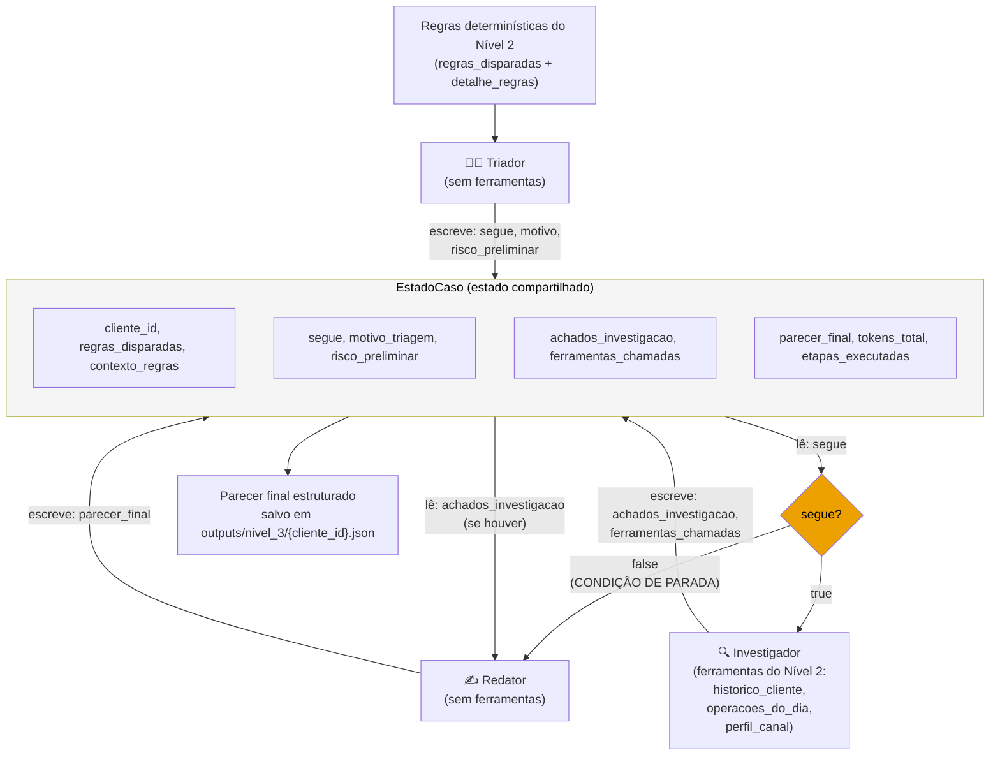

# Arquitetura — Nível 3, Trilha A (fluxo multiagente)

Três papéis encadeados, cada um lendo/escrevendo um **estado compartilhado**
(`EstadoCaso`, em `nivel_3/multiagente.py`) que acumula o que já se sabe sobre
o caso conforme ele avança pelo fluxo.



## Os três papéis

| Papel | Ferramentas | Entrada | Saída no estado |
|---|---|---|---|
| **Triador** | nenhuma | `regras_disparadas` + `contexto_regras` (resumo já calculado pelas regras determinísticas do Nível 2) | `segue`, `motivo_triagem`, `risco_preliminar` |
| **Investigador** | as 3 do Nível 2 (`historico_cliente`, `operacoes_do_dia`, `perfil_canal`) — só roda se `segue=True` | decisão do Triador | `achados_investigacao`, `ferramentas_chamadas` |
| **Redator** | nenhuma | decisão do Triador + achados do Investigador (se houver) | `parecer_final` |

## Condição de parada

O fluxo **não** é uma cadeia fixa de 3 chamadas — o Triador pode encerrar o
caso antes do Investigador rodar. Isso é modelado como um branch simples no
orquestrador (`rodar_fluxo`, em `nivel_3/multiagente.py`):

```python
estado = papel_triador(estado)
estado = papel_investigador(estado)  # no-op se estado.segue == False
estado = papel_redator(estado)
```

`papel_investigador` verifica `estado.segue` logo na primeira linha e retorna
o estado inalterado se for `False` — a etapa mais cara do fluxo (a única com
ferramentas e potencialmente vários turnos de function calling) só roda
quando o Triador julga que vale a pena.

Testado nos 4 clientes de demonstração (`docs/DECISOES.md` explica a escolha
da amostra): 3 seguiram para investigação completa (`CLI-003`, `CLI-023`,
`CLI-028`), e 1 foi arquivado direto pelo Triador sem gastar a investigação
(`CLI-008` — sinal isolado, múltiplo de 5,3x bem próximo do limiar mínimo de
5x, sem outros agravantes).

## Por que não uma cadeia fixa de 3 chamadas sempre?

Chamar Triador → Investigador → Redator incondicionalmente para todo caso
seria, na prática, o mesmo problema que o enunciado já alertava para o
agente do Nível 2: script disfarçado de agente. O Triador existe justamente
para que o fluxo tenha uma decisão real — nem todo caso sinalizado por uma
regra simples (que o próprio enunciado admite gerar falso positivo) precisa
da investigação mais cara.
